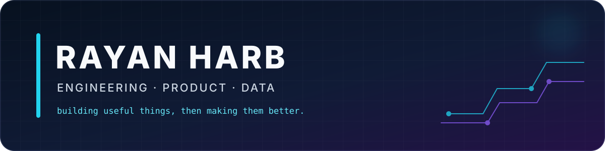

<p align="center">
  
</p>

<p align="center">
  <strong>Engineering Student · Product Builder · Canadian Armed Forces</strong><br/>
  Building practical systems across software, data, robotics, and entrepreneurship.
</p>

<p align="center">
  <a href="https://github.com/rayan-harb?tab=repositories">Explore the projects →</a>
</p>

## Hey, I'm Rayan 👋

I like taking messy, real-world problems and turning them into things people can actually use. My work sits at the intersection of **engineering**, **software**, **data**, and **product thinking**—from autonomous robots and student tools to business systems and digital products.

```text
problem → prototype → test → measure → improve → ship
```

### What I'm building

| Focus | What it means in practice |
|---|---|
| 🤖 Intelligent systems | Autonomous robotics, sensing, control, and decision logic |
| 🧠 Student technology | Tools that reduce friction in studying, planning, and learning |
| 📊 Data & operations | Dashboards, analysis, workflow automation, and process improvement |
| 🚀 Digital products | Turning ideas into clear, usable, launch-ready experiences |

### Toolbox

**Languages**


**Product, data & engineering**


### Build queue

- **[UniBudget](https://github.com/rayan-harb/uni-budget)** — an Excel/VBA personal-finance, forecasting, and decision-support platform
- **[Uni-Time](https://github.com/rayan-harb/uni-time)** — an Excel/VBA student productivity and decision-support system
- **StudyForge** — an all-in-one student study assistant
- **[RONIN](https://github.com/rayan-harb/ronin-sumo-robot)** — an autonomous sumo robot combining embedded C++, sensor fusion, and mechanical design
- **Operations & Data Lab** — practical analytics, dashboards, and automation projects
- **Commerce Systems** — product and workflow systems behind real digital brands

### How I work

I care about understanding the problem before touching the solution, explaining technical decisions clearly, and finishing with evidence that the result works. Every featured repository here is being shaped around the same standard: a clear problem, documented decisions, a working demo, and honest lessons learned.

<p align="center">
  <sub>Currently turning strong ideas into well-documented, recruiter-ready builds.</sub>
</p>
